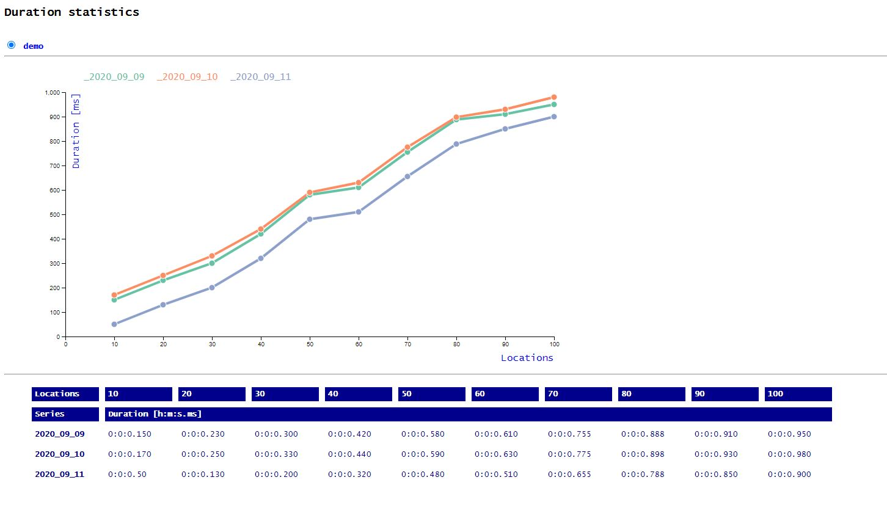

## Node & Express & D3.js Visualization Solution

#### 1. Run visual-d3 server:
```
npm install
npm start
```

***

#### 2. [Frontend on localhost](http://localhost:1111)


***

#### 3. API

- [Documentation](https://documenter.getpostman.com/view/6384621/TVYF8JeU)

- Test using [Postman collection](./VISUAL_D3.postman_collection.json) & [Postman environment](./VISUAL_D3.postman_environment.json)
  
   ```bash
   newman run VISUAL_D3.postman_collection.json -e VISUAL_D3.postman_environment.json
   ```
